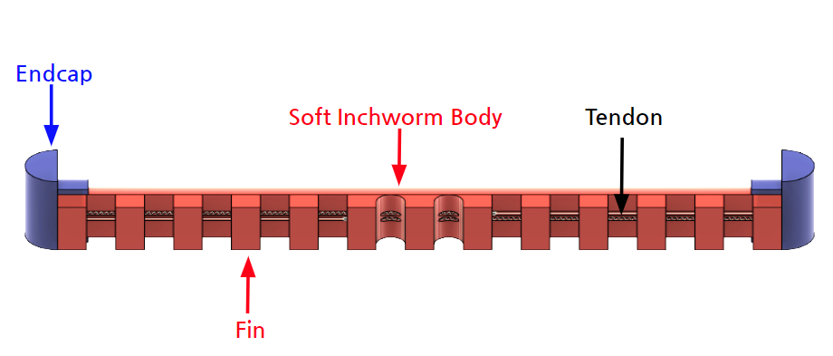
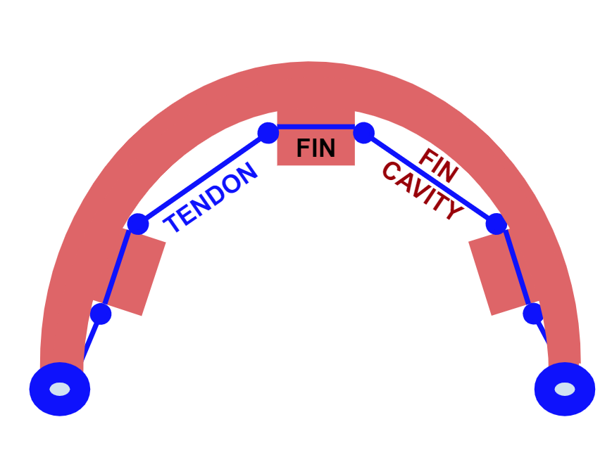
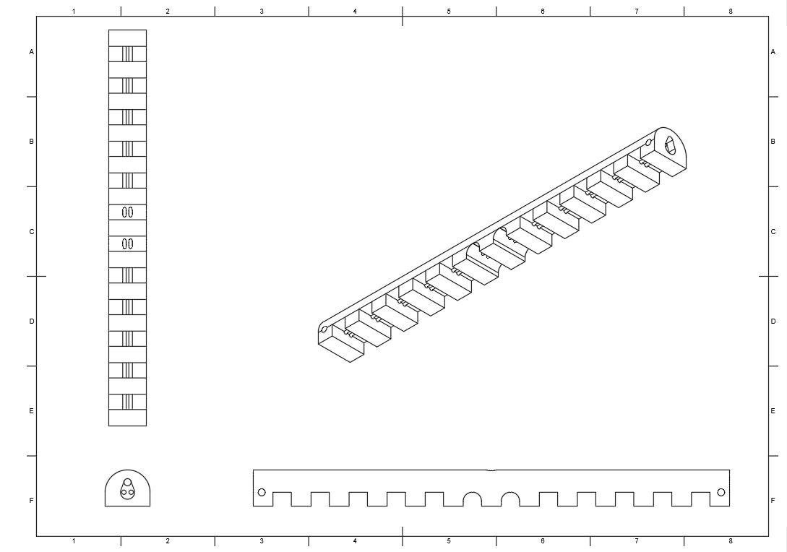
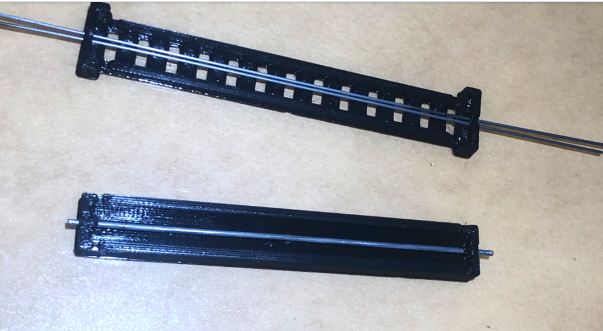
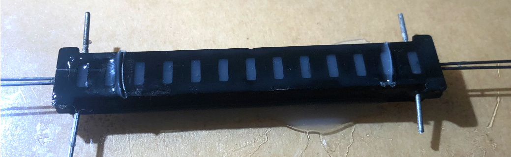
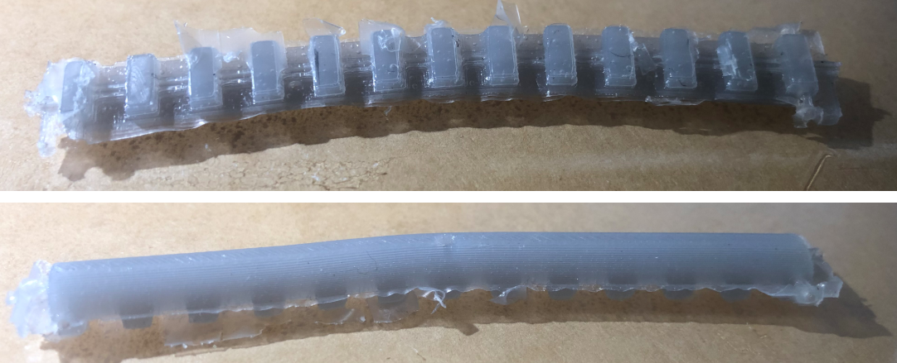
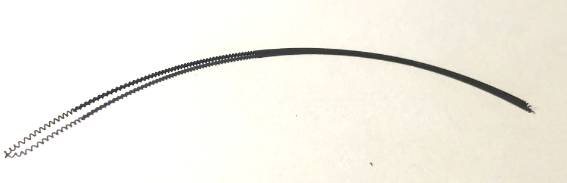
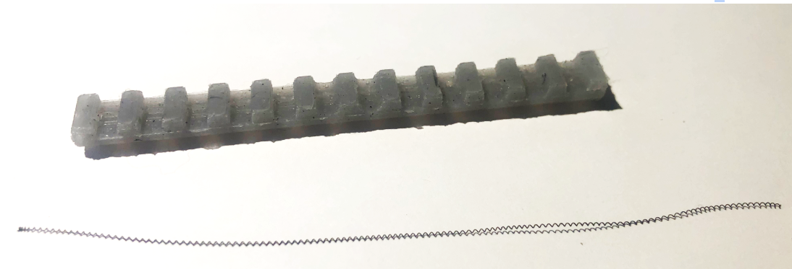
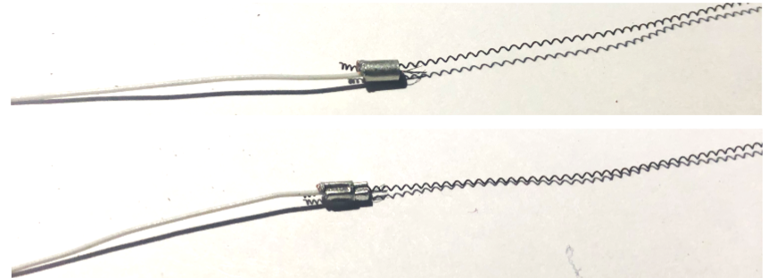

# Inchworm
This repository details the design, fabrication, and control of a soft inchworm robot with embedded SMA tendons. 

## Morphology and Design

The morphology and design parameters of a soft, tendon-actuated inchworm are dependent on the following:
- actuator type (e..g., motor, SMA)
- actuator size and shape
- material properties
- expected environment interaction
- extent of self-containment / tethers
- desired control actions (e.g.,  inching, rolling, grabbing, turning)

However, the design can be generally categorized into three components:
1. Soft inchworm body
2. Hard endcaps
3. Tendons and channels

The figure below shows this basic morphology and the terminology for the design parameters.

### Fins (Prolegs)
Our current inchworm body design consists of 13 fins, which can be thought of as analogs to caterpillar prolegs. 
Similar inchworm robots have been designed with fewer fins https://www.liebertpub.com/doi/full/10.1089/soro.2018.0082 https://ieeexplore.ieee.org/stamp/stamp.jsp?tp=&arnumber=8722784, more fins https://ieeexplore.ieee.org/document/7527653, smaller, ridge-like fins, or no fins at all https://ieeexplore.ieee.org/abstract/document/8722724

Rigid links without fins https://ieeexplore.ieee.org/abstract/document/6269102, https://ieeexplore.ieee.org/stamp/stamp.jsp?arnumber=9248054 have also been propossed.  

#### Motivation
Fins primarily are used to achieve and encourage greater deformation. In tendon-based inchworm robots, the portion of the tendon that is channeled through the fins will experience greater difficulty in contracting than the portion channeled through the adjacent fin cavity due to the lack of boundary and subsequent ability to straighten. This is shown in the figure below.

Note that this creates a linkage system, wherein the deformability of the links is dependent on the material properties. Creating fins allows for greater curvature with the same force. This is especially true for SMA tendons embedded in a silicone bbody due to the thermal shielding of the silicone, which increases the time for limb relaxation. The linkages further provide more predictability to the shape of the body by relying on this discretized linkage system rather than a single continuous buckling body. 

Fins also provide greater versatility by  allowing the body to traverse obstacles and high-roughness environments. This can be compared to the traction that is provided by the threads on tires. 

One drawback to fins is that the fin cavities leave the tendons exposed to potential damage in the environment interactions.

##### Design
Deciding on the number, width, and height of the fins is dependent on the material properties, tendon design, and expected environment interactions. Using fewer, wider fins that are spaced out may allow for greater deformation at the cost of stability and tendon exxposure. It may also impede the ability to interact with obstacles and cause radial stress on the tendon channels in the fins which can lead to tearing. However, thinner fins may be prone to buckling and breakage. Caterpillars do not employ uniform leg spacing. When working with exposed tendons, however, the best method of mimicking such spacing may be to simply decrease the height of some of the inner fins. This may encourage passive relaxation of the body.

## Fabrication
Fabrication of the robbot consists of the following steps:
1. Mold creation: the mold is modeled in CAD software, then 3D-printed.
2. Casting: the soft body is casted in the mold using curable silicone rubber. 
3. Tendon routing: the SMA is crimped to wire and threaded through the tendon channels to bbe secured in place through compression fitting of the soft body channels. The wires are then routed through the top channel and exit through a central hole.
4. Adding endcaps: the endcaps 3D printed and then connected to the soft body by inserting the pins of the endcap into the corresponding holes in the soft body. Super glue can then be used to ensure adhesion. 

#### Materials

Mold creation
- Fusion 360: CAD software
- Cura LulzBot Edition: slicing software
- LulzBot Mini: 3D printer
- nGen Amphora filament

Casting
- 1/16 in diameter piano wire
- 1/32 in diameter piano wire
- Dragon Skin 10 Part A Platinum Cure Silicone Rubber
- Dragon Skin 10 FAST Part B Platinum Cure Silicone Rubber

Tendon Routing
- Toki Biometal Helix BMX1501000: SMA
- Jaguar JSF3607-9 wire
- Preciva Dupont Ratcheting Crimper PR-3254
- Flush cutters 

### Mold Creation
Mold creation begins by modeling the inchworm body in CAD, as shown below. 

#### Casting

#### Tendon Routing

#### Adding Endcaps

